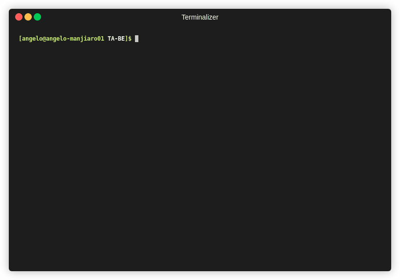

# TA-BE



## Notes

Test coverage is not the best. I've just added some demo test to showcase how the codebase can be tested.  
There is no anti-cheat in place, one user could easly send numbers that are out of what's allowed. The code trusts the users.

## How to use
Install dependencies (node v12.16.2)

```bash
npm i
```

To start the game, run the app twice in two different terminals with

```bash
npm start
```

To start one of the player in interactive mode, run

```bash
npm start -- -i
```
